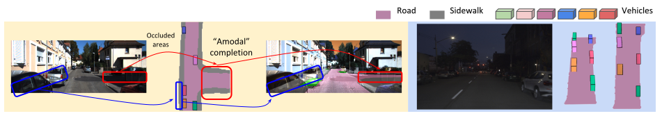
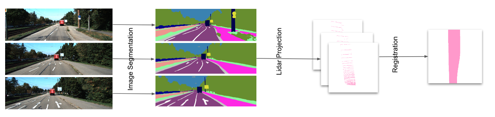
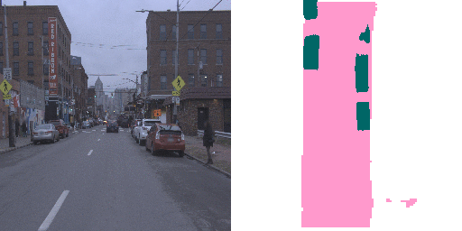
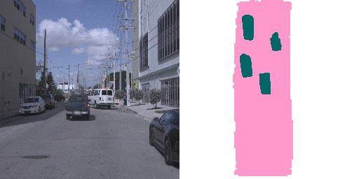

# MonoLayout: Amodal Scene Layout from a single image
#### Kaustubh Mani, Swapnil Daga, Shubhika Garg, N. Sai Shankar, [J. Krishna Murthy](https://krrish94.github.io), and [K. Madhava Krishna](http://robotics.iiit.ac.in)

#### [Paper](https://arxiv.org/abs/2002.08394), [Video](https://www.youtube.com/watch?v=HcroGyo6yRQ)

#### Accepted to [WACV 2020](http://wacv20.wacv.net/)

<p align="center">
    
</p>

## Abstract

In this paper, we address the novel, highly challenging problem of estimating the layout of a complex urban driving scenario. Given a single color image captured from a driving platform, we aim to predict the bird's-eye view layout of the road and other traffic participants. The estimated layout should reason beyond what is visible in the image, and compensate for the loss of 3D information due to projection. We dub this problem amodal scene layout estimation, which involves "hallucinating" scene layout for even parts of the world that are occluded in the image. To this end, we present MonoLayout, a deep neural network for real-time amodal scene layout estimation from a single image. We represent scene layout as a multi-channel semantic occupancy grid, and leverage adversarial feature learning to hallucinate plausible completions for occluded image parts. Due to the lack of fair baseline methods, we extend several state-of-the-art approaches for road-layout estimation and vehicle occupancy estimation in bird's-eye view to the amodal setup for rigorous evaluation. By leveraging temporal sensor fusion to generate training labels, we significantly outperform current art over a number of datasets. On the KITTI and Argoverse datasets, we outperform all baselines by a significant margin. We also make all our annotations, and code publicly available. A video abstract of this paper is available at https://www.youtube.com/watch?v=HcroGyo6yRQ

## TL;DR

State-of-the-art amodal scene layout from a single image @ >32 fps*

* Benchmarked on an Nvidia GeForce GTX 1080Ti GPU

## Contributions

* We propose MonoLayout, a practically motivated deep architecture to estimate the amodal scene layout from just a single image.
* We demonstrate that adversarial learning can be used to further enhance the quality of the estimated layouts, specifically when hallucinating large missing chunks of a scene.
* We evaluate against several state-of-the-art approaches, and outperform all of them by a significant margin on a number of established benchmarks (KITTI-Raw, KITTI-Object, KITTIOdometry, Argoverse).
* Further, we show that MonoLayout can also be efficiently trained on datasets that do not contain lidar scans by leveraging recent successes in monocular depth estimation.

## Repository Structure

```
monolayout/
├── data
│   └── osm              # Contains OSM maps constituting the true data distribution for roads
├── monolayout           # Contains scripts for dataloaders and network/model architecture
├── preprocessing        
│   ├── argoverse        # Contains scripts for generating weak supervision and groundtruth for Argoverse Tracking dataset
│   └── kitti            # Contains scripts for generating weak supervision and groundtruth for KITTI datasets
└── splits
    ├── 3Dobject         # Training and testing splits for KITTI 3DObject Detection dataset 
    ├── argo             # Training and testing splits for Argoverse Tracking v1.0 dataset
    ├── odometry         # Training and testing splits for KITTI Odometry dataset
    └── raw              # Training and testing splits for KITTI RAW dataset(based on Schulter et. al.)
```


## Installation

We recommend setting up a Python 3.7 Virtual Environment and installing all the dependencies listed in the requirements file. 

```
git clone https://github.com/hbutsuak95/monolayout.git

cd monolayout
pip install -r requirements.txt
```


## Datasets

In the paper, we've presented results for KITTI 3Dobject, KITTI Odometry, KITTI RAW and Argoverse 3D Tracking v1.0 datasets. For comparision with [Schulter et. al.](https://cseweb.ucsd.edu/~mkchandraker/pdf/eccv18_occlusionreasoning.pdf), We've used the same training and test splits sequences from the KITTI RAW dataset. For more details about the training/testing splits one can look at the `splits` directory. 

```

# Download KITTI RAW
./data/download_datasets.sh raw

# Download KITTI 3D Object
./data/download_datasets.sh object

# Download KITTI Odometry
./data/download_datasets.sh odometry
  
# Download Argoverse Tracking v1.0
./data/download_datasets.sh argoverse
```

The above scripts will download, unzip and store the respective datasets in the `data` directory. 


## Preprocessing

Training data for static and dynamic layouts are generated separately. For generating dynamic layout we use the 3D bounding box information provided with the KITTI 3Dobject detection dataset and project it to the bird's eye view. For generating static layouts, we project 2D segmentation(using [inplace-abn](https://github.com/mapillary/inplace_abn)) onto the raw lidar points to obtain the lidar segmentation. We then make use of odometry information to register these lidar points and finally project them in bird's eye view. We also provide already generated 2D segmentation using `inplace_abn` for KITTI RAW and Argoverse Tracking v1.0 dataset [here](https://iiitaphyd-my.sharepoint.com/:f:/g/personal/kaustubh_mani_research_iiit_ac_in/EgvDW4T0gldEjzI_9WUcpEAB63W_NH2o7lcTDyqfU-gl7Q?e=L2eYd6).


### Weak Supervision(Static Layout)

As proposed in the paper, training data for static layouts can be generated by projecting 2D segmentation onto the lidar space to obtain the lidar segmentation and using the odometry information to register the lidar segmentation over multiple frames and finally projecting it onto the bird's eye view. The following code generates the weak supervision over the entire dataset for both KITTI RAW and Argoverse Tracking dataset. We also provide support for generating supervision for any particular KITTI RAW sequence to enable extension of our work to other KITTI sequences/datasets not used in the paper. For generating training and validation data for Argoverse Tracking dataset we make use of the [argoverse-api](https://github.com/argoai/argoverse-api.git). For KITTI Odometry dataset, we make use of [semanticKITTI](http://semantic-kitti.org/) which provides labelled 3D Lidar segmentation, this helps us in generating much smoother supervision. Already generated static weak supervision for KITTI RAW, KITTI Odometry and Argoverse datasets can be found [here](https://iiitaphyd-my.sharepoint.com/:f:/g/personal/kaustubh_mani_research_iiit_ac_in/EuyvjAZzO4xAlCnekbfU5_4B3I3Ek29uB9N4qWdcZe65mQ?e=kyWcdz).

```
# Generating Weak Static Layouts for a KITTI RAW sequence
./preprocessing/kitti/generate_supervision.py --base_path ../data/raw/ --seg_class road --date 2011_09_26 --sequence 0001 --range 40 --occ_map_size 256

# Generating Weak Static Layouts for the entire KITTI RAW dataset
./preprocessing/kitti/generate_supervision.py --base_path ../data/raw/ --seg_class road --process all --range 40 --occ_map_size 256

# Generating Weak Static Layouts for the entire Argoverse Tracking v1.0 dataset
./preprocessing/argoverse/generate_weak_supervision.py --base_path ../data/argoverse/argoverse-tracking --seg_class road --occ_map_size 256 --range 40 
```
<p align="center">
    
</p>


### GroundTruth(Static and Dynamic Layouts)

In order to generate groundtruth bird's eye view layouts, we rely on labelled 3D bounding boxes as well as groundtruth lane polygon information provided with the Argoverse Tracking dataset through [argoverse-api](https://github.com/argoai/argoverse-api.git). KITTI 3DObject detection dataset also provides the groundtruth 3D bounding box labels, which we use to obtain dynamic layouts in bird's eye view. For KITTI RAW and KITTI Odometry datasets, we manually annotate static layouts in bird's eye view. We provide already generated static and dynamic layout groundtruths for respective datasets [here](https://iiitaphyd-my.sharepoint.com/:f:/g/personal/kaustubh_mani_research_iiit_ac_in/EqScIV6AWMZAgh7e0fEzFkQBPAoEGBEU4qzVsToJu-6cNw?e=VZ8v1W).


```
# Generating Dynamic Layouts for KITTI 3Dobject detection dataset (GroundTruth)
./preprocessing/kitti/generate_supervision.py --base_path ../data/object/training/label_2 --seg_class vehicle --range 40 --occ_map_size 256

# Generating Dynamic Layouts for Argoverse Tracking v1.0 dataset (GroundTruth)
./preprocessing/argoverse/generate_groundtruth.py --base_path ../data/argoverse/argoverse-tracking --seg_class vehicle --range 40 --occ_map_size 256 

# Generating Static Layouts for Argoverse Tracking v1.0 dataset (GroundTruth)
./preprocessing/argoverse/generate_groundtruth.py --base_path ../data/argoverse/argoverse-tracking --seg_class road --range 40 --occ_map_size 256 

```

For more details, See [preprocessing/kitti/README.md](preprocessing/kitti/README.md) and [preprocessing/argoverse/README.md](preprocessing/argoverse/README.md)


## Training

Example code for training MonoLayout on different datasets in respective modes are provided below. Run the script with `--help` or `-h` flag to know more about the command line arguments that can be used to set precise training parameters.


```

# Monolayout Static (KITTI Odometry)
python3 train.py --type static --split odometry --data_path ./data/odometry/sequences/ --height 1024 --width 1024 --occ_map_size 256

# Monolayout Dynamic (KITTI 3DObject)
python3 train.py --type dynamic --split 3Dobject --data_path ./data/object/training/ --height 1024 --width 1024 --occ_map_size 256

# Monolayout Static (KITTI RAW)
python3 train.py --type static --split raw --data_path ./data/raw/ --height 1024 --width 1024 --occ_map_size 256

# Monolayout Dynamic (Argoverse Tracking v1.0)
python3 train.py --type dynamic --split argo --data_path ./data/argoverse/ --height 1024 --width 1024 --occ_map_size 256

# Monolayout Static (Argoverse Tracking v1.0)
python3 train.py --type static --split argo --data_path ./data/argoverse/ --height 1024 --width 1024 --occ_map_size 256


```


## Testing

To generate layouts predicted by a particular trained model, use the `test.py` code and specify specific the mode of training as well as the path to the model directory. Also specify the input image directory as well as the output directory where the predictions will be saved.  

```
python3 test.py --type <static/dynamic> --model_path <path to the model directory> --image_path <path to the image directory>  --out_dir <path to the output directory> 

```

## Evaluation

For evaluating a trained model use `eval.py` by specifying the mode used for training, the data split on which to evaluate as well as the path to the trained model directory. 


```
# Evaluate on KITTI Odometry 
python3 eval.py --type static --split odometry --model_path <path to the model directory> --data_path ./data/odometry/sequences --height 512 --width 512 --occ_map_size 128

# Evaluate on KITTI 3DObject
python3 eval.py --type dynamic --split 3Dobject --model_path <path to the model directory> --data_path ./data/object/training

# Evaluate on KITTI RAW
python3 eval.py --type static --split raw --model_path <path to the model directory> --data_path ./data/raw/

# Evaluate on Argoverse Tracking v1.0 (Static)
python3 eval.py --type static --split argo --model_path <path to the model directory> --data_path ./data/argoverse/

# Evaluate on Argoverse Tracking v1.0 (Dynamic)
python3 eval.py --type dynamic --split argo --model_path <path to the model directory> --data_path ./data/argoverse
```

## Pretrained Models

The following table provides links to the pretrained models for each dataset mentioned in our paper, with specific input/output parameters used for training. The table also shows the corresponding evaluation results for these models. 


| Dataset             | Model Type |  Image Size   | Layout Size|  mIOU  |  mAP  | Inference Time(fps)  | Pretrained Model |
|:-------------------:|:----------:|:-------------:|:----------:|:------:|:-----:|:--------------------:|:----------------:|
|  KITTI 3DObject     |   Dynamic  |  1024 x 1024  | 256 x 256  | 30.18  | 45.91 |         40fps        | [link](https://iiitaphyd-my.sharepoint.com/:f:/g/personal/kaustubh_mani_research_iiit_ac_in/Ehka1d4X-JBDk7E0iOXJ5VwBOuwbh2ci_havCU-SFr9NVQ?e=JEJHIr)  |
|  KITTI Odometry     |   Static   |   512 x 512   | 128 x 128  |  76.15 | 85.25 |         90fps        | [link](https://iiitaphyd-my.sharepoint.com/:f:/g/personal/kaustubh_mani_research_iiit_ac_in/EhvKQhOwiq9NiA3H-NoK2O0BFSY0ymftF_9ixhwWlRWABA?e=c40xYy)  |
|  Argoverse Tracking |   Dynamic  |  1024 x 1024  | 256 x 256  |  32.58 | 51.06 |         36fps        |[link](https://iiitaphyd-my.sharepoint.com/:f:/g/personal/kaustubh_mani_research_iiit_ac_in/EmM6qDHz_LdPhOt1t8pVy44BkpMy8NQG-um7H24HBJRqiA?e=xSlg9c)  |
|  Argoverse Tracking |   Static   |  1024 x 1024  | 256 x 256  |  73.25 | 84.56 |         36fps        |[link](https://iiitaphyd-my.sharepoint.com/:f:/g/personal/kaustubh_mani_research_iiit_ac_in/Eptj9pcxVzlDvdLCqO8LtMABLqNCtty8dNZSpmd-p9Y8AA?e=X3zS2F)  |


## Results

| KITTI  | Argoverse |
|:------:|:---------:|
|<p align="center"> </p> | <p align="center"></p>|
|<p align="center"></p> | <p align="center"></p>|

## Citing (BibTeX)

If you find this work useful, please use the following BibTeX entry for citing us!

```
@inproceedings{mani2020monolayout,
  title={MonoLayout: Amodal scene layout from a single image},
  author={Mani, Kaustubh and Daga, Swapnil and Garg, Shubhika and Narasimhan, Sai Shankar and Krishna, Madhava and Jatavallabhula, Krishna Murthy},
  booktitle={The IEEE Winter Conference on Applications of Computer Vision},
  pages={1689--1697},
  year={2020}
}
```
